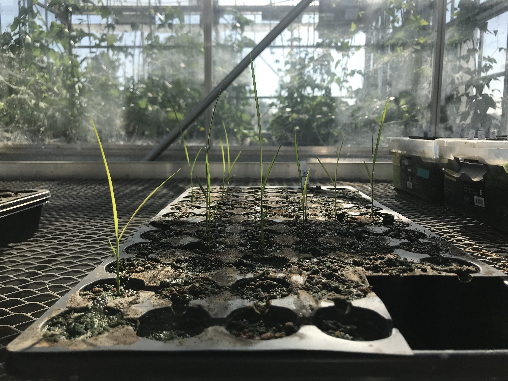

## Research Overview

#### Evolution of pathogenic/beneficial lifestyles

#### Nutrient niches in the rhizosphere

#### Bacterial adaptation to plant hosts

While many plant-associated pathogens and mutualists are highly specific to a single host, it is unclear to what extent commensal rhizosphere bacteria are adapted to a specific type of plant.

#### Nitrogen cycling in agricultural soils

Nitrogen is frequently the limiting nutrient in agricultural systems, which

#### The role of the soil microbiome in seedling vigor

Soil conditions can have a strong effect on the germination rate, health, and growth rate (seedling vigor) of direct-seeded rice, which ultimately can affect crop yield. I am interested in understanding the role that colonization of the seedling by soil bacteria has in modulating seedling vigor. This will illuminate the earliest steps of phytobiome assembly and potentially lead to microbe-based strategies that enhance seedling growth or protect from pathogens.

[back](./)
